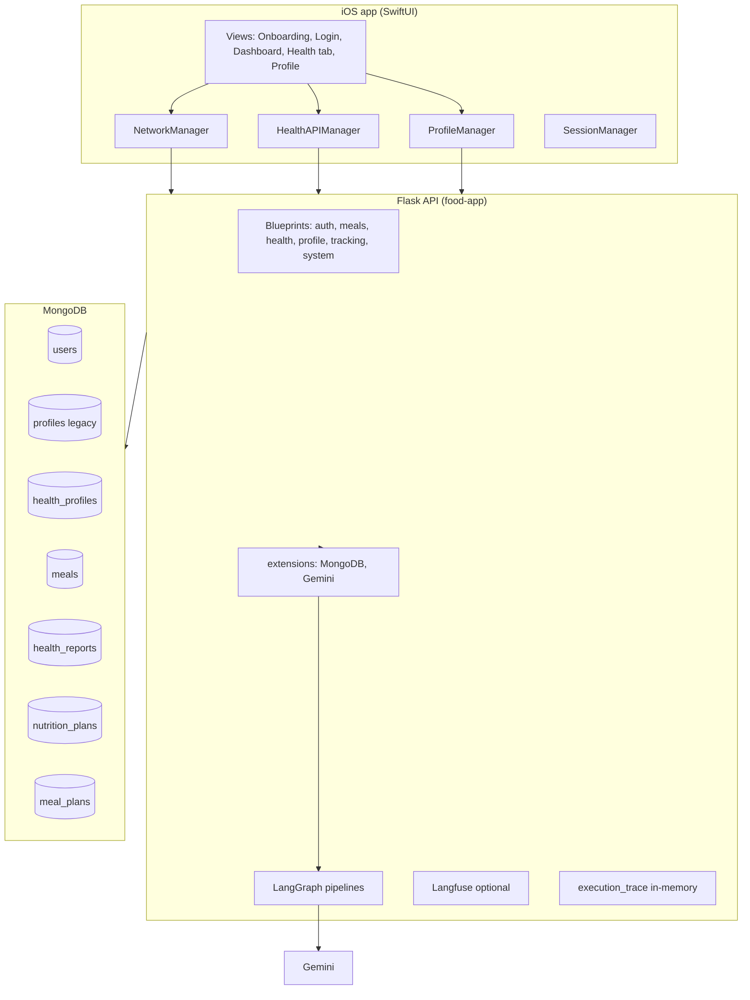
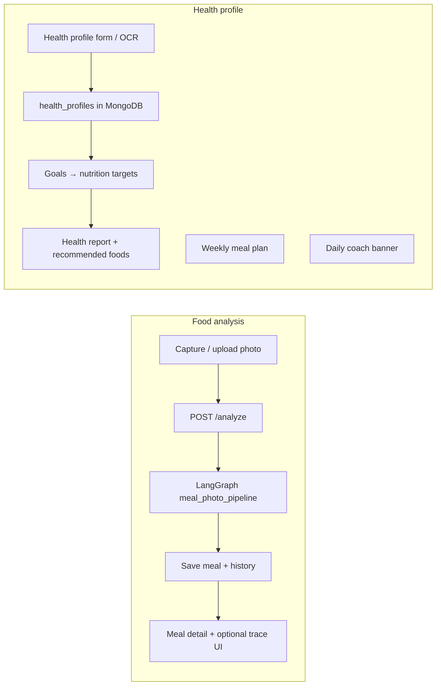
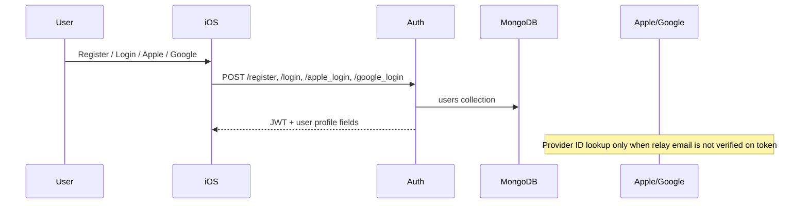
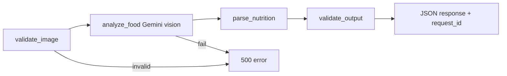

# NutriCam — System Architecture

NutriCam is a health-focused food logging app that combines **photo-based meal analysis** with **personalized health coaching**. Users photograph meals, receive AI-powered nutrition breakdowns, maintain a clinical health profile, and get daily guidance tailored to their vitals, diet, and eating patterns.

This document is for developers joining the project. It explains what the system does, how data flows end to end, and where the important code lives—without requiring you to read every source file first.

---

## 1. App overview

### What NutriCam is

NutriCam helps people understand what they eat and how it relates to their health. The product has two pillars:

| Pillar | User-facing value |
|--------|-------------------|
| **Food analysis** | Point the camera at a meal; get dish name, ingredients, macros, and optional per-meal insights. |
| **Health profile** | Store vitals, clinical markers, diet preferences, and allergens; drive nutrition targets, health reports, meal plans, and the daily coach banner. |

### Core mission

Turn passive food logging into **actionable, personalized health guidance**—not generic calorie counting alone. The backend uses **Google Gemini** for vision and text generation, **LangGraph** for structured multi-step pipelines, and **Langfuse** (optional) for observability.

### Tech stack

| Layer | Technologies |
|-------|----------------|
| **iOS client** | SwiftUI, URLSession, PhotosUI, Google Sign-In, Apple Sign-In |
| **API** | Flask (Python), Gunicorn on Render |
| **Data** | MongoDB (users, profiles, meals, health_profiles, meal_plans, health_reports, nutrition_plans, etc.) |
| **AI** | Google Gemini (`gemini-2.5-pro` in production config) |
| **Orchestration** | LangGraph state machines (`meal_photo_pipeline`, `health_plan_pipeline`, `daily_banner_pipeline`) |
| **Observability** | Langfuse (no-op if API keys missing); in-memory execution traces via `request_id` |
| **Email** | Gmail SMTP (verification codes, password reset) |

### High-level system diagram



**Caption:** The iOS app talks to Flask blueprints; Flask reads/writes MongoDB and runs LangGraph pipelines that call Gemini. Optional Langfuse traces and in-memory step traces support debugging.

### Two main features (product view)



---

## 2. Architecture overview

### Backend layout (`food-app/`)

| Path | Role |
|------|------|
| `app.py` | Flask app factory: CORS, HTTPS redirect in production, blueprint registration, error handlers |
| `extensions.py` | MongoDB client, Gemini model, indexes, shared dicts (`meal_plan_jobs`, `verification_store`) |
| `auth_utils.py` | JWT helpers, Apple/Google token verification, **account merge** (`find_or_create_user_for_provider`, provider-id-first lookup) |
| `blueprints/` | Route modules grouped by domain (see §7) |
| `meal_photo_graph.py` | LangGraph: validate image → Gemini analyze → parse nutrition → validate output |
| `health_plan_graph.py` | LangGraph: load profile → meal_analyzer → Gemini health report |
| `daily_banner_graph.py` | LangGraph: load context → analyze signals → Gemini message → validate |
| `meal_analyzer.py` | Rule-based meal history analysis (3 time windows, nutrient gaps, cooking styles) |
| `model_pipeline.py` | Delegates meal analysis to `meal_photo_graph` |
| `health_pipeline.py` | Delegates health report to `health_plan_graph` |
| `observability.py` | Langfuse client; no-op when keys absent |
| `execution_trace.py` | In-memory traces keyed by `request_id` (1h TTL) |
| `gmail_sender.py` | SMTP for verification and password reset emails |
| `render.yaml` | Render.com: `gunicorn app:app`, keep-alive via background thread pinging `/ping` |

### iOS layout (`food-app-swift/`)

| Area | Key files |
|------|------------|
| **Entry** | `food_app_swiftApp.swift`, `ContentView.swift` |
| **Auth** | `SessionManager.swift`, `LoginView.swift`, `RegisterView.swift`, `NetworkManager.swift` |
| **Profile (legacy)** | `ProfileManager.swift` → now wraps `HealthAPIManager` for health profile CRUD |
| **Health API** | `HealthAPIManager.swift`, `Healthmodels.swift` |
| **Meals** | `UploadMealView.swift`, `MealDetailView.swift`, `Meal.swift`, `BatchUploadView.swift` |
| **Health UI** | `DietPlanView.swift`, `HealthProfileView.swift`, `GoalSelectionView.swift`, `PlanGeneratorView.swift` |
| **Theme** | `AppTheme.swift`, `ThemeManager` (via environment object) |
| **Offline** | `NetworkMonitor.swift`, offline banner on dashboard |

### LangGraph pipelines (backend)

| Pipeline | Nodes | Purpose |
|----------|-------|---------|
| `meal_photo_pipeline` | `validate_image` → `analyze_food` → `parse_nutrition` → `validate_output` | Single-meal photo analysis with optional `request_id` in response |
| `health_plan_pipeline` | `load_profile` → `analyze_history` → `generate_plan` → `format_output` | Personalized health report from profile + 90-day meal history |
| `daily_banner_pipeline` | `load_context` → `analyze_health` → `generate_message` → `validate_output` | One-sentence daily banner (Gemini + rule fallback) |

---

## 3. Authentication flow

### Overview

Authentication uses **JWT** (7-day expiry, HS256) stored client-side after login/register/OAuth. Protected routes use `@token_required`, which sets `request.user_id` from the token payload.



### Email and password

| Step | Endpoint | Behavior |
|------|----------|----------|
| Register | `POST /register` | Creates user with hashed password, `login_methods: ["email"]`, returns JWT |
| Login | `POST /login` | Validates credentials, returns JWT |
| Reset password | `POST /reset_password` | Email code via Gmail SMTP |
| Verify email | `POST /verify_code` | Marks email verified |
| Link email/password | `POST /link-email-password` | Adds password to existing account |

### Google Sign-In

1. iOS obtains Google ID token via Google Sign-In SDK.
2. `POST /google_login` with `{ id_token, email, name }`.
3. Backend verifies token with Google, then runs **account merge lookup** (see below).
4. Returns JWT and user info.

### Apple Sign-In

1. iOS obtains Apple identity token.
2. `POST /apple_login` with `{ identity_token, email, name }`.
3. Backend verifies JWT against Apple JWKS (`APPLE_CLIENT_ID`), with bundle ID fallback.
4. Same merge lookup as Google; returns JWT.

### Account merging (critical behavior)

Implemented in `auth_utils.find_or_create_user_for_provider()`. Lookup order:

1. **`apple_id` or `google_id`** on `users` (including legacy `apple_sub` / `google_sub`)
2. **Email** from the provider token (if present)
3. **`known_email`** from request body (when client sends it—e.g. linking flow)
4. **Create new account** with provider IDs stored

**Limitation (honest):** If a user signs in with Apple for the first time and there is **no active session** with a known email, the client cannot automatically attach Apple to an existing email account without `known_email` in the request. Product-level account linking UI may be needed for relay-email edge cases.

### JWT session management

- Generated in `auth_utils.generate_token(user_id)` after successful auth.
- Stored in iOS `SessionManager` (`UserDefaults`: token, user_id, name, email, login_methods).
- `Authorization: Bearer <token>` on API calls.
- Expiry: `JWT_EXPIRATION_HOURS` (default 7 days × 24h from app config).

### Auth-related routes (summary)

| Route | Method | Auth |
|-------|--------|------|
| `/register` | POST | No |
| `/login` | POST | No |
| `/apple_login` | POST | No |
| `/google_login` | POST | No |
| `/reset_password`, `/send_password_reset_code`, `/verify_code` | POST | No |
| `/send_verification` | POST | Yes |
| `/delete_account`, `/update_name`, `/get-login-methods`, `/link-email-password` | various | Yes |

---

## 4. Food analysis feature

### User flow

1. User opens upload (camera, library, or batch).
2. Image is compressed and sent as **multipart** `POST /analyze` with JWT.
3. Backend runs **`run_meal_photo_pipeline`** (LangGraph).
4. Response JSON maps to **`GeminiResult`** on iOS (dish, description, hidden ingredients, nutrition_info, optional **`request_id`**).
5. User reviews/edits, then **`POST /save-meal`** persists to `meals` collection.
6. Optional: **`GET /trace/<request_id>`** loads step trace for “View Analysis Steps” in `MealDetailView`.

### LangGraph: `meal_photo_pipeline`



| Node | Responsibility |
|------|----------------|
| `validate_image` | Size/format checks via `validate_image_for_analysis` |
| `analyze_food` | Single-pass Gemini vision; produces dish, ingredients, nutrition text |
| `parse_nutrition` | Parse pipe-delimited nutrition lines into structured fields |
| `validate_output` | Reject empty dish or failed analysis patterns |

**What Gemini receives (analyze step):** Image bytes + user context; returns text including `nutrition_info` in pipe format (`Calories|…`, macros, etc.).

**Example response shape (core fields):**

```json
{
  "dish_prediction": "Grilled chicken salad",
  "image_description": "chicken|150|g|piece\nlettuce|30|g|...",
  "hidden_ingredients": "olive oil|15|ml|...",
  "nutrition_info": "Calories|420|kcal\nProtein|35|g\n...",
  "request_id": "uuid-string",
  "user_id": "..."
}
```

### Display on iOS

- **`UploadMealView`**: Shows detected dish, editable ingredients, nutrition breakdown (`BeautifulNutritionView`), save.
- **`MealDetailView`**: Full meal view; if `request_id` present, shows **“View Analysis Steps”** (pipeline steps from `/trace/<request_id>`).
- **`MealHistoryView`**: Lists saved meals from `GET /user-meals`.

### Batch upload

- **`BatchUploadView`**: Multiple images; each item calls the same analyze path.
- Backend returns per-item success/failure; iOS shows progress and summary.
- Failed items do not block successful ones from being saved individually by the user.

### Analysis trace visibility

| Component | Behavior |
|-----------|----------|
| Backend | Each analysis run gets a UUID `request_id`; steps recorded in `execution_trace` (in-memory, 1h TTL) |
| API | `GET /trace/<request_id>` returns `{ request_id, steps: [{ name, status, duration_ms, output_summary, ... }] }` |
| iOS | `MealDetailView` button hidden if no `request_id` or trace 404 |

### Meal history storage (MongoDB)

Collection: **`meals`** (via `meals_collection` in code).

Typical document fields include: `user_id`, `dish_prediction`, `image_description`, `hidden_ingredients`, `nutrition_info`, `image_full` / `image_thumb` (base64), `saved_at`, `meal_type`, optional `request_id`, `ai_insight`, `from_diet_plan`, `compliance_score`, etc.

---

## 5. Health profile feature

### What the user inputs

Captured in **`HealthProfileView`** (multi-step wizard):

- Body: height, weight, age, sex
- Optional clinical: blood pressure, fasting blood sugar, cholesterol, triglycerides
- Diet: dietary preference tags (vegetarian, vegan, keto, gluten-free, etc.)
- Allergens: multi-select list

Also available: **`ProfileSetupView`** / **`EditHealthProfileView`** for onboarding-style edits via `ProfileManager` (backed by same health profile APIs).

### Storage

| Store | Collection | Notes |
|-------|------------|--------|
| Primary | `health_profiles` | One document per `user_id` (upsert). **Not versioned**—updates overwrite. |
| Legacy | `profiles` | Older onboarding profile fields; `ProfileManager` may still sync calorie/activity fields here. |

Saving a health profile via `POST /save-health-profile` **deletes** existing `health_reports` for that user (forces regeneration on next health report fetch).

### OCR flow (camera / PDF / DOCX)

```mermaid
sequenceDiagram
    participant User
    participant HealthProfileView
    participant API
    participant Google Vision
    participant Gemini optional

    User->>HealthProfileView: Pick image or document
    HealthProfileView->>API: POST /ocr-health-report (base64 image)
    API->>Google Vision: Document text detection
    alt OCR fails or no Gemini
        API-->>HealthProfileView: Regex extraction only
    else API->>Gemini: Extract structured vitals JSON
    API-->>HealthProfileView: systolic_bp, diastolic_bp, blood_sugar, etc.
    User->>HealthProfileView: Review and save via save-health-profile
```

**Limits:** Image max 10MB; Vision OCR timeout 20s; supports en/zh language hints.

### How profile data feeds other features

| Consumer | Uses health profile data |
|----------|-------------------------|
| `POST /generate-targets` | Full profile + selected goals → Gemini daily macros |
| `POST /generate-health-report` | Profile + **90-day meal history** via `meal_analyzer.py` |
| `POST /generate-meal-plan-async` | Nutrition plan + health profile + **30-day meal history** in prompt |
| `GET /daily-banner-message` | Profile + 7-day meals + optional health report |
| `POST /meal-insight` | Profile + health report snapshot + meal nutrition for one dish |

---

## 6. AI features — how each one works

### A) Nutrition targets (`GoalSelectionView` → `/generate-targets`)

| Aspect | Detail |
|--------|--------|
| **Entry** | After health profile exists; user selects health goals in `GoalSelectionView` |
| **Inputs** | `profile` (health profile JSON), `goals[]` (e.g. lose_weight, control_blood_sugar) |
| **Processing** | Direct Gemini call in `health_pipeline.generate_nutrition_targets()` (not LangGraph) |
| **Prompt focus** | Age, sex, BMI, BP, labs, diet, allergens, goals → daily calories, macros, foods to eat/avoid |
| **Storage** | `nutrition_plans` collection, keyed by `user_id` |
| **iOS** | Plan shown in `planResultView`; stored locally in UserDefaults; passed to `HealthDashboardView` |

### B) Health report + recommended foods (`/generate-health-report`)

| Aspect | Detail |
|--------|--------|
| **Inputs** | Health profile, goals (from nutrition plan or request), **up to 200 meals** from last 90 days |
| **meal_analyzer.py** | Buckets meals into 7/30/90-day windows; computes food frequency, cooking styles, nutrient averages, deficiencies/excesses, coverage %, `summary_text` for prompts |
| **LangGraph** | `health_plan_pipeline`: load_profile → analyze_history (meal_analyzer) → generate_plan (Gemini) → format_output |
| **Output** | `health_score`, `health_summary`, `recommended_foods[]`, `attention_items`, `foods_to_limit`, macro targets, `lifestyle_tip`, etc. |
| **Cache** | If report age &lt; 7 days and `force=false`, returns cached document without calling Gemini |
| **Storage** | `health_reports` collection (upsert per user) |
| **iOS** | `DietPlanView` health tab shows report, recommended foods, nutrition section |

**Recommended food item shape (example):**

```json
{
  "food": "Oatmeal",
  "reason": "...",
  "analysis_basis": "clinical_marker|nutrition_gap|meal_history_pattern|general_health",
  "dishes": ["Oatmeal with berries", "..."]
}
```

### C) Weekly meal plan (`/generate-meal-plan` + async)

| Aspect | Detail |
|--------|--------|
| **Inputs** | `nutrition_plan` (daily calories, macros), `health_profile` (dietary_preferences, allergens), `days`, `meals_per_day` |
| **Meal history enrichment** | Last **30 days** of meals fetched; `meal_analyzer` extracts top foods, nutrient gaps, cooking style dominance |
| **Prompt** | Per-day Gemini calls with cuisine variety hints; diet/allergen constraints; instruction to vary frequent foods across the plan |
| **Sync path** | `POST /generate-meal-plan` (blocking) |
| **Async path** | `POST /generate-meal-plan-async` → poll `GET /meal-plan-status/<job_id>` |
| **Storage** | `meal_plans` — **one plan per user** (latest overwrite on save) |
| **iOS** | `PlanGeneratorView` → async job → `ExpandableMealCard` per day/meal; diet-plan photo logging via `/analyze-meal-photo` |

**Async job states:** `generating` → `done` | `error`

### D) Daily health banner (`GET /daily-banner-message`)

| Aspect | Detail |
|--------|--------|
| **Pipeline** | `daily_banner_graph.py` (4 nodes) |
| **Inputs** | `health_profiles`, meals last **7 days**, latest `health_reports` (optional) |
| **analyze_health signals** | Clinical flags (BP, glucose, cholesterol, triglycerides thresholds), top nutrient gaps/excesses, dominant cooking style, dietary prefs, health_score, time-of-day |
| **generate_message** | Gemini: exactly **one sentence**, max 20 words, warm tone; no “should/must/consult/doctor/medical” |
| **validate_output** | Word count 5–25, single sentence, forbidden words blocked |
| **Fallback** | `build_daily_banner_message()` rule chain if Gemini/validation fails |
| **Caching** | Server: in-memory `{user_id}_{date}` 24h; iOS: UserDefaults same key pattern |

**Example banner tone:** *“Your protein has been low this week — try adding an egg or some tofu to lunch today.”*

### E) Meal insight (`POST /meal-insight`)

| Aspect | Detail |
|--------|--------|
| **When** | Per-meal, after save (or when viewing meal detail) |
| **Inputs** | Dish name, nutrition_info, ingredients text, **health profile**, latest **health report** from MongoDB |
| **Output** | Structured insight (macros, warnings, etc.) stored on meal document as `ai_insight` |
| **Note** | Separate from the LangGraph meal **analysis** pipeline; uses health context for personalized commentary |

---

## 7. Backend structure

### Blueprint modules

| Blueprint | Prefix | Main responsibilities |
|-----------|--------|----------------------|
| `system` | — | `/`, `/health`, `/ping`, `/debug-env`, `/trace/<request_id>` |
| `auth` | `/` (auth routes at root) | Register, login, OAuth, password reset, account |
| `profile` | `/` | Legacy `/save-profile`, `/get-profile`, dashboard stats, insights |
| `meals` | `/` | `/analyze`, `/save-meal`, `/user-meals`, update/delete, recalc, `/meal-insight` |
| `health` | `/` | Health profile, targets, meal plans, health reports, OCR, daily banner, analyze-meal-photo |
| `tracking` | `/` | Exercise, water, weight logs |

**Total route count:** 44 original routes preserved from monolith refactor, plus system trace endpoint.

### Shared modules

| Module | Role |
|--------|------|
| `extensions.py` | MongoDB, Gemini init, DB indexes, `meal_plan_jobs`, `verification_store` |
| `auth_utils.py` | JWT, OAuth verification, account merge helpers |
| `model_pipeline.py` | Entry for meal photo analysis → `meal_photo_graph` |
| `health_pipeline.py` | Entry for health report → `health_plan_graph` |
| `meal_analyzer.py` | Meal history analytics (used by health report + meal plan prompts) |
| `observability.py` | Langfuse (optional) |
| `execution_trace.py` | In-memory traces by `request_id` |
| `gmail_sender.py` | Transactional email |

### LangGraph pipelines (detail)

| Pipeline | File | Entry function |
|----------|------|------------------|
| Meal photo | `meal_photo_graph.py` | `run_meal_photo_pipeline()` |
| Health report | `health_plan_graph.py` | `run_health_plan_pipeline()` |
| Daily banner | `daily_banner_graph.py` | `run_daily_banner_pipeline()` |

### Observability (Langfuse)

- Env: `LANGFUSE_PUBLIC_KEY`, `LANGFUSE_SECRET_KEY`, `LANGFUSE_HOST`
- If keys missing: all Langfuse helpers **no-op**; app continues normally
- Spans wrap LangGraph nodes (`lf_node_span`) and Gemini calls (`lf_generation`)
- Meal analysis also records steps in `execution_trace` with `request_id`

### Execution trace API

```
GET /trace/<request_id>
→ { "request_id": "...", "steps": [ { "name", "status", "duration_ms", "output_summary", ... } ] }
```

Traces expire after **1 hour** (in-memory). Used by iOS meal detail UI.

### MongoDB collections (primary)

| Collection | Purpose |
|------------|---------|
| `users` | Auth accounts, provider IDs, login_methods |
| `health_profiles` | Canonical extended health data for coaching features |
| `profiles` | Legacy profile fields (calorie target, activity_level, diet booleans) |
| `meals` | Meal logs and analysis metadata |
| `health_reports` | Latest personalized health report per user (upsert) |
| `nutrition_plans` | Generated daily macro targets from goals flow |
| `meal_plans` | Weekly meal plan documents |
| `meal_logs` | Diet-plan photo compliance logs |
| `analysis_record` | Historical analysis records (legacy path) |

Indexes include sparse unique `apple_id`, `google_id` on users, and compound indexes on meals (`user_id`, `saved_at`).

### Deployment (`render.yaml`)

- **Web service:** Gunicorn, `app:app`, 4 threads, 120s timeout
- **Env:** `GEMINI_API_KEY`, `MONGO_URI`, `MONGO_DB`, `JWT_SECRET_KEY`, `ENVIRONMENT=production`
- **Keep-alive:** Background thread pings `https://food-app-swift-qb4k.onrender.com/ping` every 25 minutes

---

## 8. iOS app structure

### Navigation flow

```mermaid
flowchart TD
    Launch[App launch] --> Onboarding[OnboardingView]
    Onboarding --> Login{Logged in?}
    Login -->|No| LoginView
    Login -->|Yes| ContentView
    ContentView --> HealthCheck{health_profile?}
    HealthCheck -->|No| HealthProfileView
    HealthCheck -->|Yes| GoalSelectionView
    HealthCheck -->|Yes| HealthDashboardView
    HealthDashboardView --> Tabs[Today | Health | Profile]
```

- **`OnboardingView`**: First-time experience (not wired from `ContentView` in all paths—exists as standalone).
- **`ContentView`**: Gates on `healthProfile` + `nutritionPlan` in UserDefaults after onboarding.
- **`HealthDashboardView`**: TabView with Today (`DashboardView`), Health (`DietPlanView`), Profile (`ProfileView`).

### Key managers and services

| Component | Responsibility |
|-----------|----------------|
| `SessionManager` | JWT, user id/name/email, login state, onboarding flags |
| `NetworkManager` | HTTP client, `/analyze`, auth endpoints, token header |
| `HealthAPIManager` | `/get-health-profile`, `/save-health-profile`, health report, meal plan async, daily banner, meal insight, trace fetch |
| `ProfileManager` | Facade over health profile APIs; maps to `UserProfile` for legacy UI |
| `RecalculationManager` | Nutrition recalculation after ingredient edits |
| `ThemeManager` | Light/dark `AppTheme` via environment object |

### Feature → file map (iOS)

| Feature | Primary Swift files |
|---------|---------------------|
| Login / Register | `LoginView.swift`, `RegisterView.swift`, `NetworkManager.swift` |
| Dashboard / meals | `Dashboardview.swift`, `UploadMealView.swift`, `MealDetailView.swift` |
| Health tab | `DietPlanView.swift`, `GoalSelectionView.swift`, `PlanGeneratorView.swift` |
| Health profile wizard | `HealthProfileView.swift`, `ProfileSetupView.swift`, `EditHealthProfileView.swift` |
| Profile settings | `ProfileView.swift`, `EditPersonalInfoView.swift` |
| Daily banner UI | `DailyHealthBanner.swift` (message from API) |
| Batch upload | `BatchUploadView.swift` |
| Offline | `NetworkMonitor.swift` |

### Models

- **`Meal`**, **`GeminiResult`** (includes optional `request_id`)
- **`HealthProfile`**, **`NutritionPlan`**, **`HealthReport`**, **`WeeklyMealPlan`**, **`TraceStep`**

---

## 9. Data flow diagrams

### End-to-end: meal photo analysis

```
User captures image
    → UploadMealView compresses image
    → NetworkManager POST /analyze (multipart + JWT)
    → Flask meals blueprint → run_meal_photo_pipeline()
        → validate_image → analyze_food (Gemini) → parse_nutrition → validate_output
    → JSON { dish_prediction, nutrition_info, request_id, ... }
    → User edits → POST /save-meal → MongoDB meals.insert
    → MealDetailView displays meal
    → Optional: GET /trace/{request_id} → execution_trace steps → UI sheet
```

### End-to-end: health report generation

```
User completes health profile + goals
    → GoalSelectionView → POST /generate-targets → nutrition_plans
User opens Health tab → DietPlanView
    → If no cached report or stale: POST /generate-health-report
        → fetch 90-day meals from MongoDB
        → meal_analyzer.analyze_meal_history(meals)
        → health_plan_pipeline: load_profile → analyze_history → generate_plan (Gemini)
    → health_reports upsert
    → UI shows score, recommended foods, attention items
```

### End-to-end: weekly meal plan

```
PlanGeneratorView sends nutrition_plan + health_profile + days/meals_per_day
    → POST /generate-meal-plan-async
    → Background thread: fetch 30-day meals → meal_analyzer → generate_weekly_meal_plan
    → Poll GET /meal-plan-status/{job_id}
    → On success: meal_plans upsert, UI renders ExpandableMealCard per day
```

### End-to-end: daily banner

```
Dashboard onAppear → loadDailyBannerMessage()
    → Check UserDefaults cache (per user per calendar day)
    → Else GET /daily-banner-message
        → daily_banner_graph: load_context (profile, 7d meals, health report)
        → analyze_health → generate_message (Gemini) → validate_output
    → Fallback to rule-based message if needed
    → Cache on server + display in DailyHealthBanner(message:)
```

---

## 10. Known limitations and future work

Document honestly so new developers plan work correctly.

| Area | Current state |
|------|----------------|
| **Apple account linking** | Provider login without active session + `known_email` cannot auto-merge by email alone |
| **Health profile versioning** | Single live `health_profiles` document; updates overwrite; saving profile clears `health_reports` |
| **Weekly meal plan history** | Only latest plan kept per user; each generation overwrites `meal_plans` |
| **Daily banner memory** | No cross-day conversation memory in LLM (Phase 3: full LLM with memory not built) |
| **Unit / UI tests** | `food-app-swiftTests` and `food-app-swiftUITests` are placeholders only |
| **`NewOnboardingView`** | Implemented but not wired into main `ContentView` navigation |
| **`FoodTrackingView`** | Referenced from dashboard settings as placeholder; exercise/water use dedicated tracking views |
| **Legacy `profiles` collection** | Still used alongside `health_profiles` during migration; `ProfileManager` bridges both |
| **Execution traces** | In-memory only; lost on server restart; not durable in MongoDB |
| **Langfuse** | Optional; required for production observability dashboards |

### Suggested next steps (product/engineering)

1. Wire `known_email` consistently on Apple/Google first login from iOS when an email account already exists.
2. Version health profiles or archive reports when vitals change materially.
3. Persist execution traces or export to Langfuse-only for long-term debugging.
4. Expand automated tests around auth merge, meal pipeline JSON shape, and async meal-plan polling.
5. Implement Phase 3 daily banner: conversational memory and richer coach tone controls.

---

## Quick reference: API routes by feature

| Feature | Method | Path |
|---------|--------|------|
| Register | POST | `/register` |
| Login | POST | `/login` |
| Apple login | POST | `/apple_login` |
| Google login | POST | `/google_login` |
| Analyze meal | POST | `/analyze` |
| Save meal | POST | `/save-meal` |
| User meals | GET | `/user-meals` |
| Health profile get/save | GET/POST | `/get-health-profile`, `/save-health-profile` |
| Nutrition targets | POST | `/generate-targets` |
| Health report | POST | `/generate-health-report` |
| Get health report | GET | `/get-health-report` |
| Meal plan async | POST | `/generate-meal-plan-async` |
| Meal plan status | GET | `/meal-plan-status/<job_id>` |
| Get meal plan | GET | `/get-meal-plan` |
| Daily banner | GET | `/daily-banner-message` |
| Meal insight | POST | `/meal-insight` |
| OCR health | POST | `/ocr-health-report` |
| Trace steps | GET | `/trace/<request_id>` |
| Ping | GET | `/ping` |

---

*Last updated to match the codebase in `food-app/` as of the health-agent documentation commit. For route-level behavior, treat `blueprints/` and `auth_utils.py` as source of truth if this document drifts from code.*